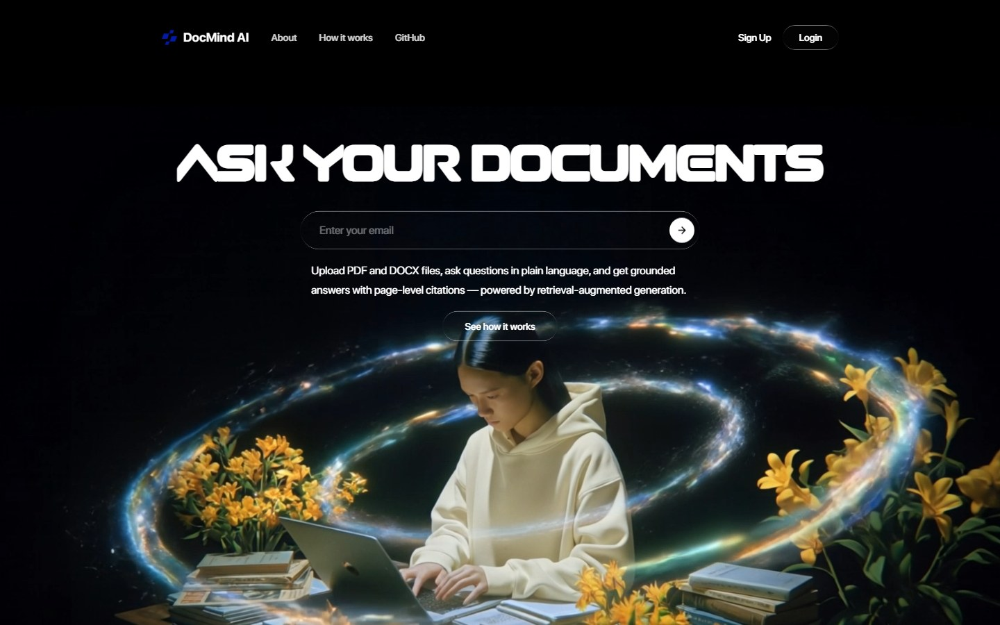
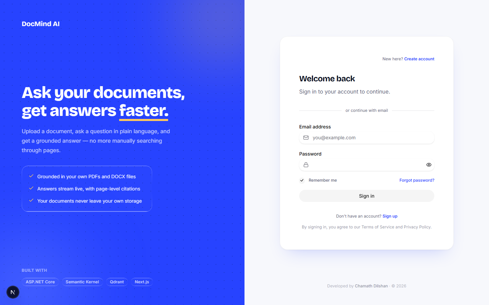
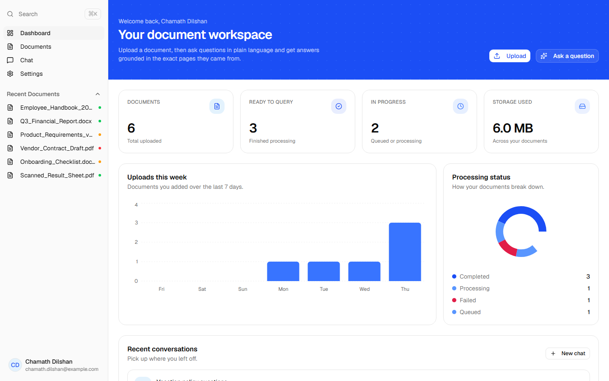
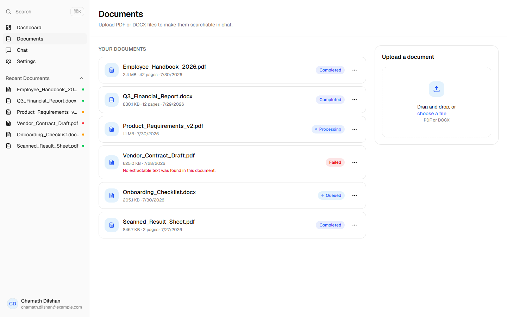
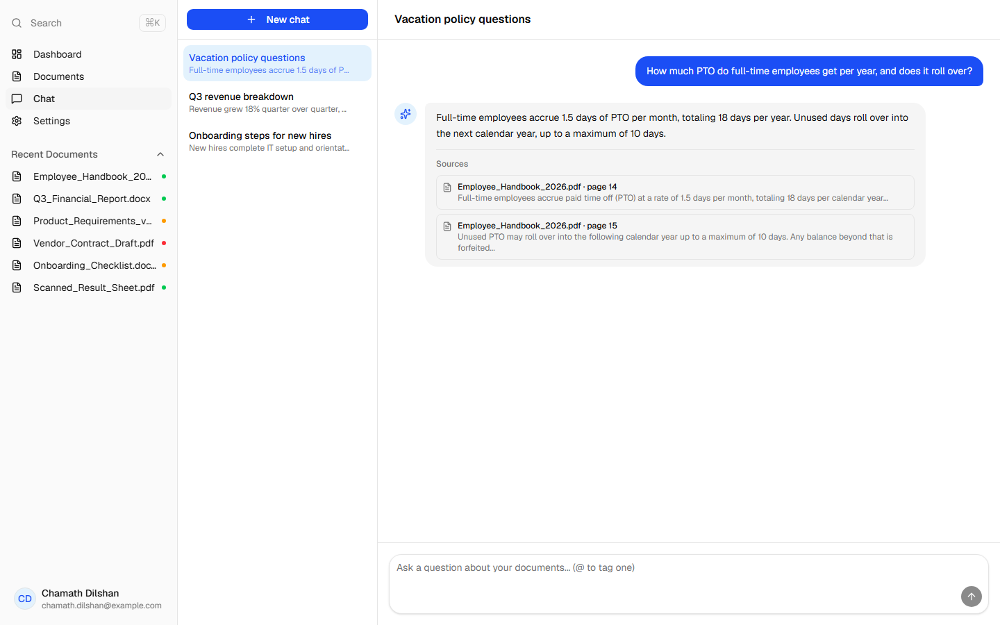
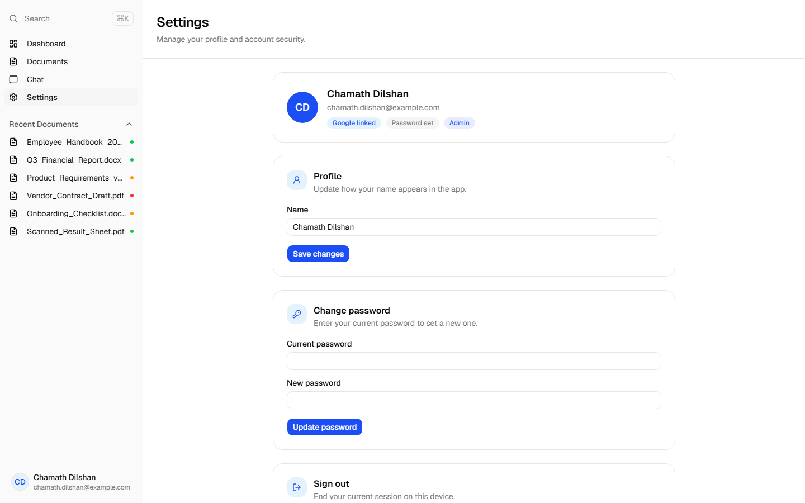
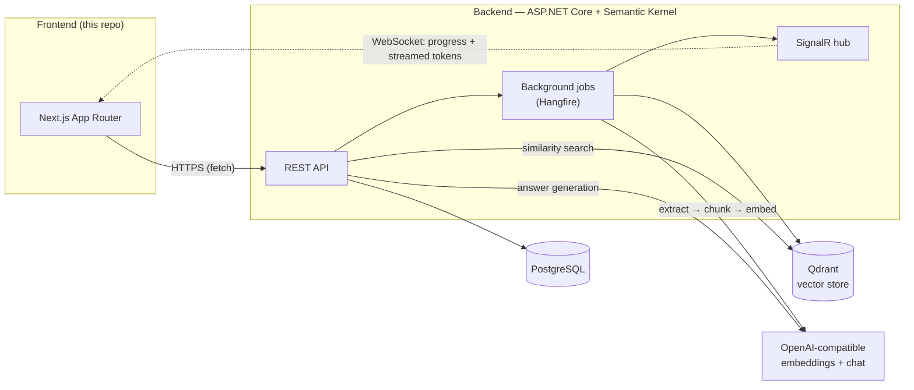
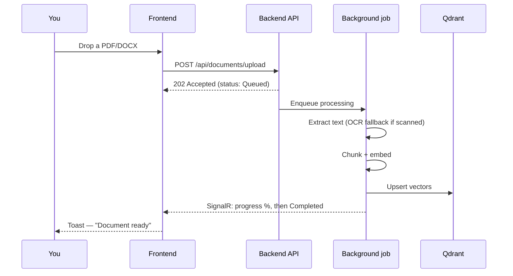
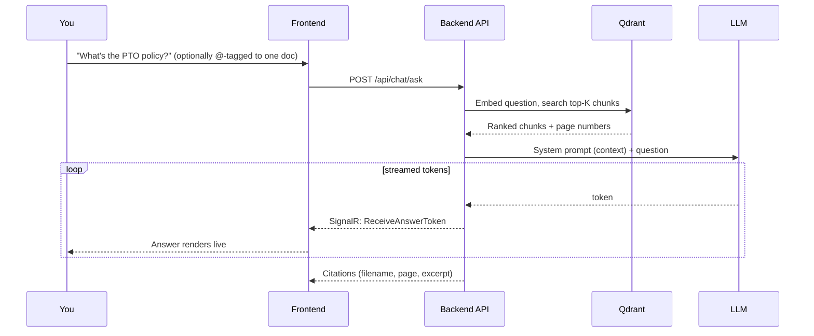

<p align="center">
  
</p>

<h1 align="center">DocMind AI — Frontend</h1>

<p align="center">
  Upload a PDF or DOCX, ask questions in plain language, get answers streamed back with the exact page they came from.
  <br />
  Next.js (App Router) client for <b>DocMind AI</b>, an AI-powered RAG document assistant.
</p>

<p align="center">
  <a href="https://frontend-doc-mind-ai.vercel.app">Live demo</a> ·
  <a href="https://github.com/ChamathDilshanC/backend-DocMind-AI">Backend repo</a> ·
  <a href="https://github.com/ChamathDilshanC/Main-DocMind-AI">Main project</a>
</p>

<p align="center">
  
  
  
  
  
</p>

---

## What it does

DocMind AI turns your own PDFs and DOCX files into something you can talk to. Upload a document, and it's
chunked, embedded, and indexed in the background with live progress. Ask a question — in the whole workspace,
or scoped to one file with `@` — and the assistant streams back a grounded answer with citations linking to the
exact page each claim came from. Nothing is answered from the model's general knowledge; if it's not in your
documents, it says so.

## Screenshots

| Landing | Sign in |
| :--: | :--: |
|  |  |
| **Dashboard** | **Documents** |
|  |  |
| **Chat with citations** | **Settings** |
|  |  |

## Features

- **Grounded chat, not a chatbot** — every answer is generated only from retrieved chunks of your own
  documents, streamed token-by-token over SignalR, with source citations (filename + page) attached to the
  message. If nothing relevant is found, it says so instead of guessing.
- **Tag a document with `@`** — scope a question to one specific file mid-conversation; the input shows an
  inline picker as you type.
- **Live document processing** — upload a PDF or DOCX and watch it move through
  `Queued → Processing → Completed` in real time, with a retry action if extraction fails. Scanned, image-only
  PDFs are OCR'd automatically as a fallback so they don't get stuck as unprocessable.
- **Conversation management** — multiple chats side by side, renamed by their first question, deletable with
  a confirm-before-delete toast and an animated exit instead of an accidental click nuking your history.
  Chat and the sidebar scroll independently, so nothing jumps around while you're mid-answer.
- **Dashboard at a glance** — total documents, ready-to-query count, storage used, a 7-day upload chart, and a
  processing-status breakdown, built with Recharts.
- **Document management** — upload (drag-and-drop or picker), rename, download, retry, delete, and view
  per-page extracted text for any document.
- **Auth that just works** — email/password or Google One Tap, JWT access + refresh tokens, client-side route
  guarding (see [why no middleware](#why-no-middleware-route-guard) below).
- **Account settings** — update your display name, set or change your password, see whether Google is linked,
  sign out.
- **Modern UI, not just functional** — [HeroUI v3](https://heroui.com) + Base UI primitives, Tailwind CSS v4,
  toasts for every async action, skeleton loading states, and light glassmorphism/animation touches instead of
  bare spinners.

## How it works



**Uploading a document:**



**Asking a question:**



## Stack

React 19, Next.js 16 (App Router, Turbopack), TypeScript, Tailwind CSS v4, [HeroUI v3](https://heroui.com) +
Base UI, TanStack Query, Zustand, Recharts, `@microsoft/signalr`, `@react-oauth/google`, React Hook Form + Zod,
[`goey-toast`](https://goey-toast.vercel.app) for notifications, Framer Motion for the small entrance/exit
animations.

## Getting started

```bash
npm install
cp .env.example .env.local   # fill in NEXT_PUBLIC_GOOGLE_CLIENT_ID
npm run dev
```

Requires the backend API running (default `http://localhost:5180`) — see
[`backend-DocMind AI/appsettings.README.md`](https://github.com/ChamathDilshanC/backend-DocMind-AI) for setup,
including how to obtain a Google OAuth Client ID.

## Project structure

- `src/app/(auth)` — login/register pages, no sidebar shell.
- `src/app/(dashboard)` — authenticated app shell (sidebar + navbar): dashboard, documents, chat, settings.
- `src/components/chat` — conversation sidebar, message list, streaming input with `@`-mention tagging.
- `src/components/documents` — upload dropzone, document list, status badges.
- `src/components/dashboard` — stat cards and chart wrappers.
- `src/lib/api` — typed fetch wrappers per backend module, with automatic 401 → refresh-token retry.
- `src/lib/signalr` — shared hub connection for document-processing progress and chat token streaming.
- `src/stores/auth-store.ts` — Zustand store (persisted to `localStorage`) holding the access/refresh tokens and user.

### Why no middleware route guard

The backend issues tokens in the response body rather than a cookie (simpler across two different local ports
without `SameSite=None; Secure` cross-origin cookie complications). Since tokens live in `localStorage`, a
server-side Next.js proxy can't see them, so route protection is done client-side in
`app/(dashboard)/layout.tsx` instead.

## Scripts

- `npm run dev` — start the dev server (Turbopack)
- `npm run build` / `npm run start` — production build/serve
- `npm run lint` — ESLint

## CI/CD

Every push to `main` type-checks, builds, and publishes a tagged GitHub release automatically —
see [`.github/workflows/release.yml`](.github/workflows/release.yml).

## License

MIT — see the [main repository](https://github.com/ChamathDilshanC/Main-DocMind-AI) for the full license text.
